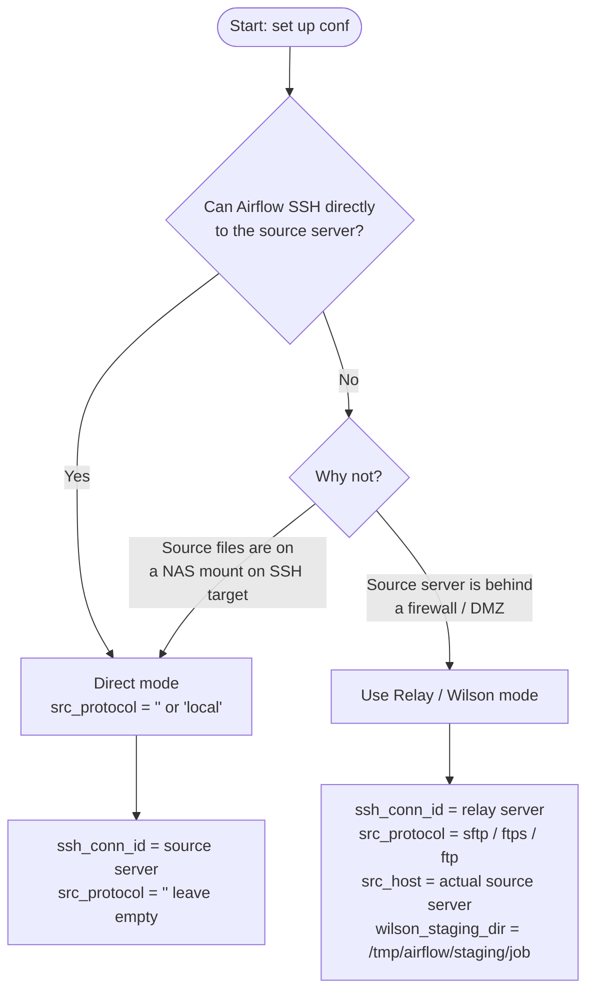
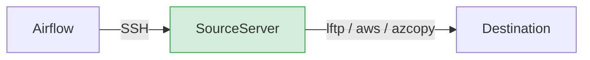
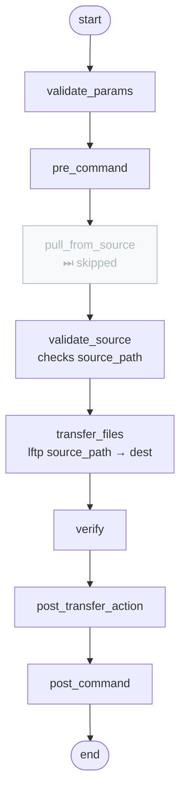
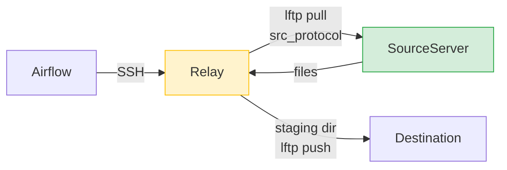
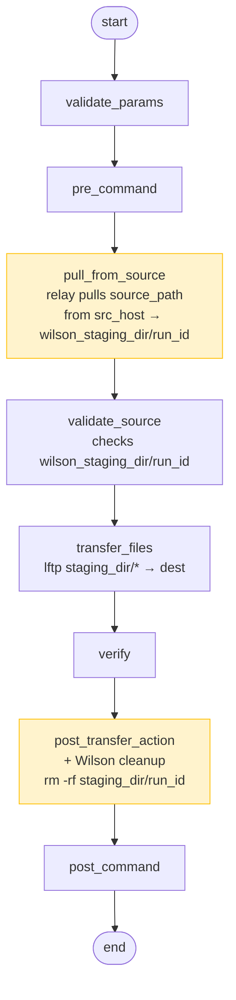

# File Transfer Reusable DAG — Unix Dynamic (lftp/azcopy via SSH)

Reusable per-project DAG for Unix file transfers. Acts like a function — all parameters
are passed at runtime by the caller via `TriggerDagRunOperator conf={}`.

One DAG handles all Unix `FILE_TRANS` jobs in the project. No infrastructure is hardcoded.
Project team owns and maintains this DAG. Isolated blast radius — changes only affect this project.

`schedule=None` — always triggered by caller via `TriggerDagRunOperator`, never runs on its own.

---

## How to choose: Direct or Relay?



---

## What happens at runtime

### Direct mode (`src_protocol` is empty or `"local"`)





### Relay mode (`src_protocol` = `sftp` / `ftps` / `ftp`)





### Relay detection rule (same check in every task)

```bash
if [ -n "${SRC_PROTOCOL}" ] && [ "${SRC_PROTOCOL}" != "local" ]; then
    # relay mode — use wilson_staging_dir as source
else
    # direct mode — use source_path directly
fi
```

| `src_protocol` value | Mode | pull_from_source |
|---|---|---|
| `""` (empty) | Direct | skipped |
| `"local"` | Direct | skipped |
| `"sftp"` | Relay | runs — lftp sftp pull |
| `"ftps"` | Relay | runs — lftp ftps pull (explicit TLS) |
| `"ftp"` | Relay | runs — lftp ftp pull |

---

## DAG task summary

| Task | Direct | Relay | Skipped when |
|---|---|---|---|
| `validate_params` | ✅ runs | ✅ runs | — |
| `pre_command` | ✅ runs | ✅ runs | `pre_command` param is empty |
| `pull_from_source` | ⏭ skipped | ✅ pulls `source_path` from `src_host` → staging | `src_protocol` empty / `local` |
| `validate_source_files` | checks `source_path` | checks `wilson_staging_dir/run_id` | `archive_only`, `cleanup_only`, `s3_download`, `blob_download` |
| `transfer_files` | `source_path` → dest | `staging_dir/*` → dest | `archive_only`, `cleanup_only` |
| `verify` | checks dest | checks dest | `archive_only`, `cleanup_only` |
| `post_transfer_action` | delete/rename/move/archive | same + Wilson cleanup (`rm -rf staging_dir/run_id`) | depends on `direction` |
| `post_command` | ✅ runs | ✅ runs | `post_command` param is empty |

---

## Parameters

### Identity (set once in the .py file)

| Variable | Description | Example |
|---|---|---|
| `_company` | Company prefix | `"nix"` |
| `_project` | Project name | `"apxxxx"` |
| `_env` | Environment | `"nonprod"` |
| `_dag_name` | DAG name suffix | `"file-transfer-unix"` |

### Runtime conf (passed per job from caller DAG)

#### Connection

| Parameter | Required | Description |
|---|---|---|
| `ssh_conn_id` | ✅ | SSH conn ID to **source server** (direct) or **relay/Wilson server** (relay) |

#### Two-hop relay — leave all empty for direct transfer

| Parameter | Required | Description |
|---|---|---|
| `src_protocol` | ➖ | `""` or `"local"` = direct; `"sftp"` / `"ftps"` / `"ftp"` = relay pull |
| `src_host` | ✅† | Source server hostname — †required when relay |
| `src_port` | ✅† | Source port: `22` (sftp) or `21` (ftp/ftps) |
| `src_user` | ✅† | Source username |
| `src_password_var` | ✅† | Airflow Variable key holding source password |
| `wilson_staging_dir` | ✅† | Staging dir on relay (e.g. `/tmp/airflow/staging/job_xyz`) |
| `wilson_cleanup` | ➖ | `"true"` (default) = delete staging after push; `"false"` = keep |

#### Transfer

| Parameter | Required | Description |
|---|---|---|
| `source_path` | ✅ | File path / glob on source server (relay) or on SSH target (direct) |
| `dest_protocol` | ✅ | `ftp` / `ftps` / `sftp` / `s3` / `blob` |
| `dest_host` | ✅* | Destination hostname or IP (*ftp/ftps/sftp only) |
| `dest_port` | ✅* | Destination port: `21` (ftp/ftps) or `22` (sftp) |
| `dest_user` | ✅* | Destination FTP/SFTP username |
| `dest_path` | ✅ | Destination path (remote for upload; local for download) |
| `password_var_name` | ✅* | Airflow Variable key holding destination password |
| `direction` | ✅ | Transfer mode — see table below |

#### S3 (required when `dest_protocol=s3`)

| Parameter | Required | Description |
|---|---|---|
| `s3_bucket` | ✅ | S3 bucket name |
| `s3_prefix` | ✅ | S3 key prefix, e.g. `data/incoming/` |
| `s3_region` | ✅ | AWS region, e.g. `ap-southeast-1` |
| `s3_endpoint_url` | ➖ | VPC endpoint URL (empty = public S3) |
| `aws_profile` | ➖ | AWS CLI named profile (empty = instance role) |
| `aws_access_key_id_var` | ➖ | Airflow Variable key for `AWS_ACCESS_KEY_ID` |
| `aws_secret_key_var` | ➖ | Airflow Variable key for `AWS_SECRET_ACCESS_KEY` |

#### Azure Blob (required when `dest_protocol=blob`)

| Parameter | Required | Description |
|---|---|---|
| `blob_account` | ✅ | Azure Storage account name |
| `blob_container` | ✅ | Blob container name |
| `blob_prefix` | ✅ | Blob path prefix, e.g. `daily/incoming/` |
| `blob_identity_client_id` | ➖ | User-assigned MI client ID (empty = system-assigned MI) |
| `blob_sas_var_name` | ➖ | Airflow Variable key holding SAS token (empty = managed identity) |

#### Post-transfer extras

| Parameter | Required | Description |
|---|---|---|
| `new_name` | ➖ | New filename for `*_rename` / `*_move` directions |
| `archive_path` | ➖ | Archive base path (default: `dest_path/archive`) |
| `retention_days` | ➖ | Days to keep archives for `cleanup_only` (default: `30`) |
| `pre_command` | ➖ | Shell command to run before transfer (empty = skip) |
| `post_command` | ➖ | Shell command to run after transfer (empty = skip) |

---

## direction values

| Value | Protocol | What happens |
|---|---|---|
| `upload` | ftp/ftps/sftp | put source → dest, keep source (SRCOPT=0) |
| `upload_delete` | ftp/ftps/sftp | put source → dest, delete source after (SRCOPT=1) |
| `upload_rename` | ftp/ftps/sftp | put source → dest, rename source to `new_name` (SRCOPT=2) |
| `upload_move` | ftp/ftps/sftp | put source → dest, move source to `new_name` path (SRCOPT=3) |
| `download` | ftp/ftps/sftp | mget remote → local, keep remote (SRCOPT=0) |
| `download_delete` | ftp/ftps/sftp | mget remote → local, delete remote after (SRCOPT=1) |
| `download_rename` | ftp/ftps/sftp | mget remote → local, rename remote to `new_name` (SRCOPT=2) |
| `download_move` | ftp/ftps/sftp | mget remote → local, move remote to `new_name` path (SRCOPT=3) |
| `download_archive` | ftp/ftps/sftp | mget remote → local, archive locally by date |
| `archive_only` | — | no transfer — archive existing files in `dest_path` by date |
| `cleanup_only` | — | no transfer — delete archives older than `retention_days` |
| `s3_upload` | s3 | aws s3 cp source_path → s3://bucket/prefix |
| `s3_download` | s3 | aws s3 cp s3://bucket/prefix → dest_path |
| `blob_upload` | blob | azcopy copy source_path → blob account/container/prefix |
| `blob_download` | blob | azcopy copy blob account/container/prefix → dest_path |
| `s3_to_blob` | s3+blob | azcopy copy s3://bucket/prefix → blob account/container (no staging) |
| `blob_to_s3` | s3+blob | azcopy copy blob account/container → s3://bucket/prefix (no staging) |

---

## Quick Start

### Step 1: Copy and rename this template

```
{company}_{project}_file_transfer_unix_{env}.py
```

### Step 2: Edit identity variables at the top of the .py

```python
_company  = "nix"
_project  = "apxxxx"
_env      = "nonprod"
_dag_name = "file-transfer-unix"
```

### Step 3: Add Airflow Connection (SSH)

- **Connection ID**: value you will pass as `ssh_conn_id` in conf
- **Connection Type**: SSH
- **Host**: source server (direct) or relay/Wilson server (relay)
- **Username / Key**: user with SSH access

### Step 4: Add Airflow Variables (passwords)

- One Variable per password referenced by `password_var_name` or `src_password_var`
- **Value**: plaintext password — Airflow encrypts it at rest

### Step 5: Call from your business DAG

```python
from airflow.operators.trigger_dagrun import TriggerDagRunOperator

# ── Direct: SSH target IS the source server ──────────────────────────────────
TriggerDagRunOperator(
    task_id='transfer_report',
    trigger_dag_id='nix-apxxxx-file-transfer-unix-nonprod',
    wait_for_completion=True,
    poke_interval=30,
    conf={
        "ssh_conn_id":       "ssh-unix-server",
        # src_protocol left empty = direct mode
        "source_path":       "/data/report/*.csv",
        "dest_host":         "dest-server",
        "dest_port":         "21",
        "dest_protocol":     "ftps",
        "dest_user":         "ftpuser",
        "dest_path":         "/incoming/report/",
        "password_var_name": "project-dest-password",
        "direction":         "upload",
    },
)

# ── Relay: SSH target is Wilson relay, source is behind firewall ──────────────
TriggerDagRunOperator(
    task_id='transfer_via_relay',
    trigger_dag_id='nix-apxxxx-file-transfer-unix-nonprod',
    wait_for_completion=True,
    poke_interval=30,
    conf={
        "ssh_conn_id":        "ssh-wilson-relay",   # SSH to relay, NOT source
        "src_protocol":       "sftp",               # relay pulls from source via sftp
        "src_host":           "source-server",
        "src_port":           "22",
        "src_user":           "srcuser",
        "src_password_var":   "project-src-password",
        "wilson_staging_dir": "/tmp/airflow/staging/transfer_report",
        "source_path":        "/exports/*.dat",     # path on source server
        "dest_host":          "dest-server",
        "dest_port":          "21",
        "dest_protocol":      "ftps",
        "dest_user":          "ftpuser",
        "dest_path":          "/incoming/",
        "password_var_name":  "project-dest-password",
        "direction":          "upload",
    },
)
```

---

## Notes

- lftp must be installed on the SSH target server (ftp/ftps/sftp)
- AWS CLI must be installed on the SSH target server (s3)
- azcopy must be installed on the SSH target server (blob)
- Passwords are read from Airflow Variables at runtime — never hardcoded in the DAG
- FTPS uses explicit TLS (AUTH TLS) — port `21` or `991`
- MVS dataset names in `dest_path` (no leading `/`) are single-quoted automatically
- Blob auth: `blob_sas_var_name` → SAS token; empty → managed identity (`azcopy login --identity`)
- `wait_for_completion=True` holds a worker slot during transfer — tune `poke_interval` to reduce polling
- Wilson staging dir is scoped per run: `wilson_staging_dir/run_id` — parallel runs never collide
